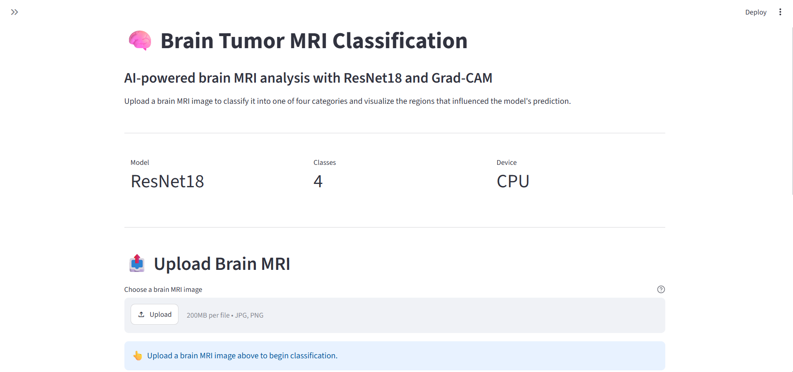
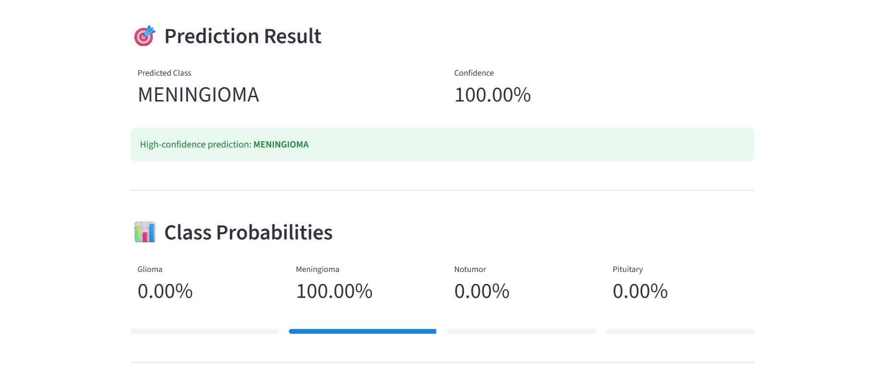
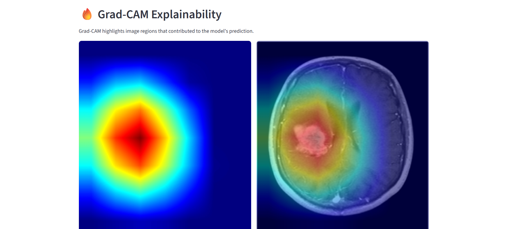

# 🧠 Brain Tumor Classification Using CNN & ResNet18 with Grad-CAM

### Deep Learning Based Brain MRI Classification & Explainable AI System

**CNN • ResNet18 • Transfer Learning • Grad-CAM • PyTorch • Computer Vision • Streamlit**

---

## 🌟 Overview

This project is a deep learning based brain tumor classification system that analyzes brain MRI images and classifies them into four categories:

- 🧠 Glioma
- 🧠 Meningioma
- 🟢 No Tumor
- 🧠 Pituitary

The project compares a custom Convolutional Neural Network with a ResNet18 transfer learning model.

Grad-CAM is integrated to provide visual explanations of the model's predictions.

The final ResNet18 model achieved **94.44% test accuracy** on 1,600 unseen MRI images.

---

## 🚀 Live Demo

**Try the application:**

https://brain-tumor-classification-cnn-gradcam-by-ashu.streamlit.app/

The application allows users to:

- Upload a brain MRI image
- Predict the tumor category
- View prediction confidence
- View class probabilities
- Generate Grad-CAM heatmaps
- Visualize regions influencing the prediction

---

## 📊 Model Performance

| Model | Validation Accuracy | Test Accuracy |
|---|---:|---:|
| Custom CNN | 85.36% | 76.69% |
| ResNet18 | **98.66%** | **94.44%** |

### 🏆 Final Model

**Architecture:** ResNet18  
**Validation Accuracy:** 98.66%  
**Test Accuracy:** 94.44%  
**Correct Predictions:** 1,511 / 1,600  
**Input Size:** 224 × 224  
**Framework:** PyTorch  
**Explainability:** Grad-CAM

---

## 🧬 Classification Categories

| Class | Description |
|---|---|
| Glioma | Tumor originating from glial cells |
| Meningioma | Tumor arising from the meninges |
| No Tumor | MRI showing no detected tumor |
| Pituitary | Tumor associated with the pituitary gland |

---

## 🖥️ Application Screenshots

### Main Interface

<p align="center">
  
</p>

### Prediction Results

<p align="center">
  
</p>

### Grad-CAM Explainability

<p align="center">
  
</p>

---

## 🏗️ System Architecture

```text
Brain MRI Dataset
       │
       ▼
Data Preprocessing
       │
       ▼
Resize Images to 224 × 224
       │
       ▼
Train / Validation Split
       │
       ├───────────────┐
       ▼               ▼
   Custom CNN       ResNet18
                       │
                       ▼
                Transfer Learning
                       │
       └───────────────┘
               │
               ▼
        Model Evaluation
               │
               ▼
        Best Model: ResNet18
               │
       ┌───────┴────────┐
       ▼                ▼
Prediction          Grad-CAM
       │                │
       ▼                ▼
Class Probabilities  Heatmap
       │                │
       └───────┬────────┘
               ▼
      Streamlit Application